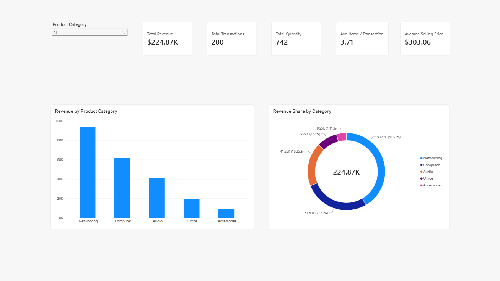

# Ujjsha Retail Executive Dashboard (Version 1.0)

## Overview

Version 1.0 of the Ujjsha Retail Executive Dashboard marks the completion of the foundational Power BI dashboard built during **DA-90 Phase 3**.

This dashboard demonstrates interactive business reporting using Power BI, DAX measures, slicers, hierarchies, drill-through navigation, and executive KPI cards.

## Dashboard Preview

## Business Scenario

Ujjsha Retail is a fictional retail company used for portfolio development. The goal of this dashboard is to help business stakeholders quickly understand sales performance through interactive reporting and drill-down analysis.

## Features

* Product Category slicer
* Executive KPI cards
* Revenue by Product Category column chart
* Revenue Share by Category donut chart
* Category → Product hierarchy
* Drill Down
* Drill Through
* Dynamic DAX measures
* Interactive filtering

## KPI Metrics

The dashboard includes five executive KPIs:

* Total Revenue
* Total Transactions
* Total Quantity
* Average Selling Price
* Avg Items / Transaction

## DAX Measures

The dashboard uses reusable DAX measures rather than relying on raw columns.

| Measure                   | Purpose                                 |
| ------------------------- | --------------------------------------- |
| `Total Revenue`           | Total sales revenue                     |
| `Total Quantity`          | Total units sold                        |
| `Total Transactions`      | Number of sales records                 |
| `Average Selling Price`   | Revenue per unit sold                   |
| `Avg Items / Transaction` | Average units purchased per transaction |

## Skills Demonstrated

* Power BI
* DAX
* Data Modeling
* Dashboard Design
* Interactive Reporting
* KPI Development
* Drill-down Navigation
* Drill-through Navigation

## Version History

| Version  | Milestone                             |
| -------- | ------------------------------------- |
| **v1.0** | Executive Dashboard with DAX Measures |
